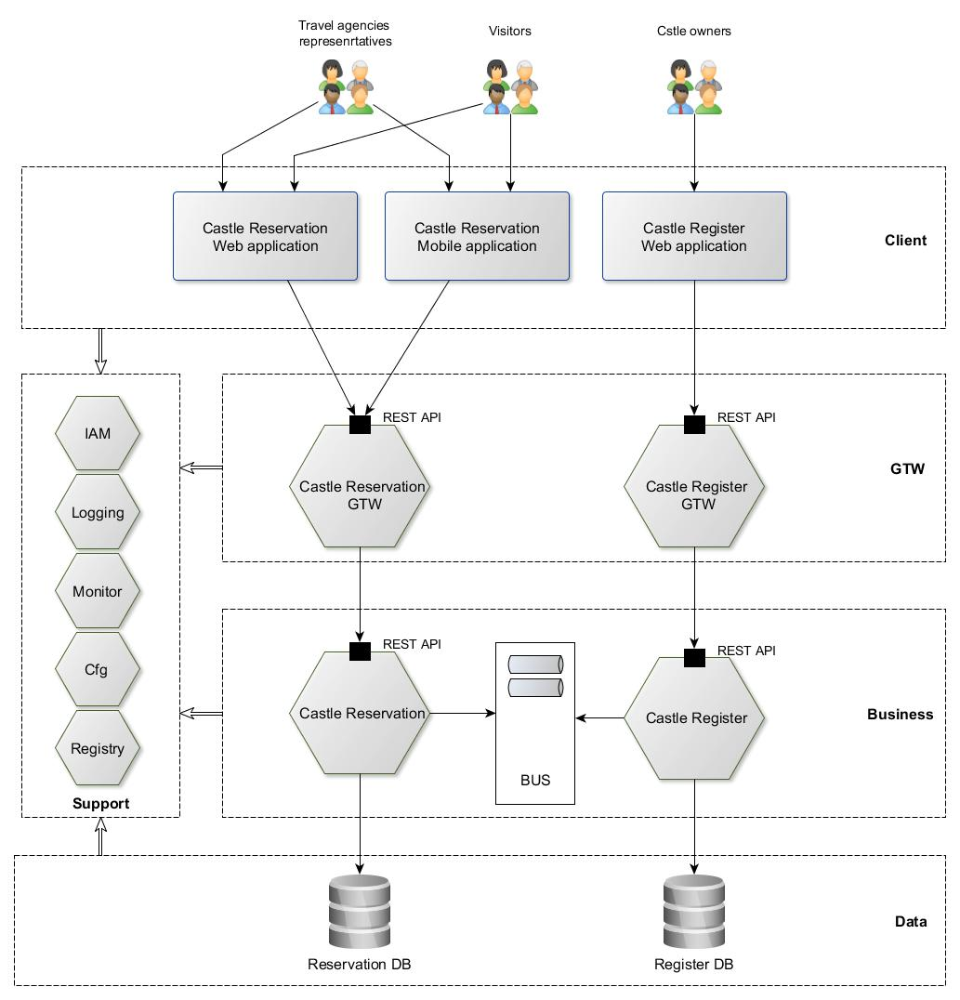
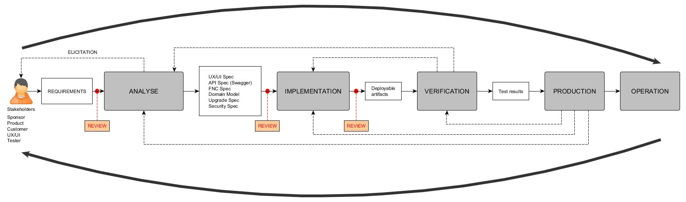

# Big picture and Architecture (HLD)
* Context of application
* Main Functions of the application
* Architecture
  * Hexagonal and Event driven
  * Functional view
  * Processes
  * Data
  * Deployment
  * Operation
  * Infrastructure
  * Security
* Dev process  

## Context of application
The Castle Reservation and Visit Management is the application, which provides the online services to Castle visitors, Castle
owners and Travel agencies. It enables a subjects to plan and book a visit, manage castle visits, pay for a visit and more...   

## Main Functions of the application
* Castle register - it is the register, which maintains details of the listed castles. Authorized user is able to create, update and delete
castle data. The register also provides the simple search function which returns castle records based on input criteria.
* Castle visit reservations - service which manages reservations for a castle visitors. A travel agency can reserve castle visits
for its clients scheduled for defined date. After a reservation is created, it can be then modified, canceled or completed.
* Online Payment for Castle Tickets - ...

### User stories
| ID | Story |
| --- | --- |
|US01| As a Visitor I'd like to search for castles according location so that I quickly access the details of the location nearest castle |
|US02| As a Castle owner I'd like to create new castle detail record so that my castle can be reserved for visit|
|US03| As a Travel agency representative I'd like to plan a castle visit so that visitors are able to reserve visit to chosen castle| 

## Architecture

* Client Tier - consists of the Castle Reservation Web and Mobile applications and the Castle Register Web application. The Castle Reservation
applications are used by a Travel agencies to schedule and manage castle visit reservations and by a Visitors to search for available castle trips and to reserve trip to chosen castle.
* Gateway Tier - consists of edge modules, which expose REST APIs to the client applications. It forces the REST API authorization and it can
adapt API for the clients. The GTW modules also implements simple API aggregation and simple business process flows.
* Business Tier - consists of modules which implement the domain logic of the application.
* Data Tier - contains data stores for business modules.
* Support Tier - consists of the supporting modules as Identity and Access Management, Logging and Monitoring, Centralized configuration and
Registry for GTW and Business modules.

### Hexagonal and Event driven
It is common, there are more architectural styles used for single solution. The layered architecture style is depicted on above picture.
As the modules in the Business Tier use domain events to synchronize their entities, they are driven by events so also Event driven architecture
comes into play. It is good practice to encapsulate the domain/business logic (which should be independent from the infrastructure) in module core and use ports and adapters to access it from outside world (concerns). We can achieve this by using the Hexagonal (Ports and Adapters) style of architecture.   

### Functional view
### Processes
### Data
Each Business module (Microservice) has its own dedicated database. If the SQL database (e.g. PostreSQL) is used, there are following strategies:
* Database server instance pre module
* Database instance on single DB server
* Database schema in single Database

### Deployment
Modules of the application can run on physical or virtual machines. These days, the Virtual machines hosted on private or public Datacenter/Cloud
are preferred as they can be setup and configured by Infrastructure as code approach. The containerized environment can be used as well. There are  several containerized environments provided as a service by the main Cloud providers as AWS, Azure, or Google.

### Operation
The application modules are monitored by the centralized service desk. As the DevOps approach is used, the Ops engineers are familiar with
the solution architecture as well as interfaces, which enable modules monitoring. Several layers are monitored:
* Network components
* Virtual machines
* Containerized environment as Kubernetes
* Infrastructure services as Databases, Message brokers, IAM etc.
* Application modules as Gateways and Business modules
Modules provides at least following monitoring endpoints:
* Health checks
* Metrics

### Infrastructure
Modules ad Components are deployed on the Cloud. So the cloud provides infrastructure services for the application/business modules.
This strategy enables organization to focus on application domain functions/logic implementation.

### Security
Module services APIs must not be directly exposed to the internet. The Cloud Gateway/Proxy is used to securely expose APIs, which
are required by the application clients. The GTW modules enforces the REST API Authorization.

## Dev process

