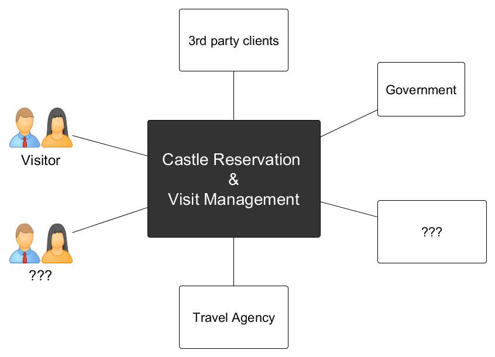

# Bif picture and Architecture (HLD)
* Context of application
* Main Functions of application
* SW Architecture
  * Hexagonal and Event driven
  * Functional view
  * Processes
  * Data
  * Deployment
  * Operation
  * Infrastructure
  * Security 
* Dev process  

## Context of application
The Castle Reservation and Visit Management is application which provide online services to Castle visitors, Castle
owners and Travel agencies. It enables subjects to plan and book a visit, manage castle visits, pay for a visit and more...   

## Main Functions of application

## SW Architecture

### Hexagonal and Event driven
### Functional view
### Processes
### Data
### Deployment
### Operation
### Infrastructure
### Security 

## Dev process