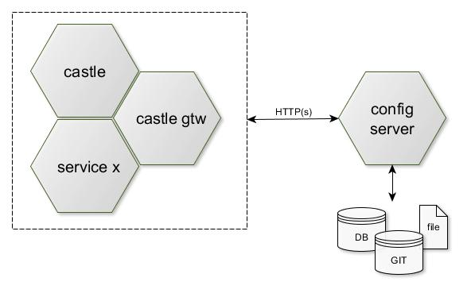

# Configuration server
Configuration of the system which consists of several distributed modules, should be centralized to simplify
system setup and keep configuration consistent for different environments. 
Spring Cloud Config provides server and client-side support for externalized configuration in a distributed system.

## Implement and start Configuration server      
1. Include `org.springframework.cloud:spring-cloud-config-server` Spring Boot starter into your application.
   Use the https://start.spring.io/ app and add dependency named as "Config Server"     
2. The SpringBoot application configuration class must be annotated with _@EnableConfigServer_ annotation 
3. The default implementation of the server storage backend uses git so it easily supports labelled versions 
   of configuration environments, as well as being accessible to a wide range of tooling for managing the content.
4. Add GIT repo configuration `spring.cloud.config.server.git.uri` into _application.properties_
   Use `spring.cloud.config.server.git.username` and `spring.cloud.config.server.git.password` to configure authentication.
5. Now, you can use Spring's _@Value_ annotation to insert configurations property into spring beans
6. Config servers supports configuration profiles, so you can configure different back-ends as SQL DB, Vault, or local file.
   If you want to pull configuration data only from repositories that are each of distinct types, you can enable 
   the corresponding profiles as `spring.profiles.active = git, vault`

## Add basic security
1. Include `org.springframework.boot:spring-boot-starter-security` Spring Boot starter into your application.
   Use the https://start.spring.io/ app and add dependency named as "Security"
2. Set the HTTP Basic Auth password for default username "user" `spring.security.user.password = password` in
   _application.properties_ file.
3. Config server supports also cfg property values encryption. To use symmetric key, just set key value in _bootstrap.properties_
   `encrypt.key = some_key`
4. Config server provides `POST /encrypt` and `POST /decrypt` endpoints for cfg values encryption.
   To mark cfg property value as encrypted use _{cipher}_ prefix `some.encrypted.property = {cipher}4b8d17b477d3820c`   
            

## References
* https://spring.io/projects/spring-cloud 
  

