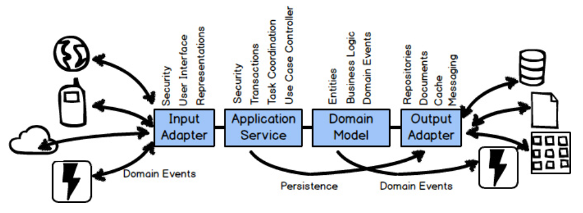
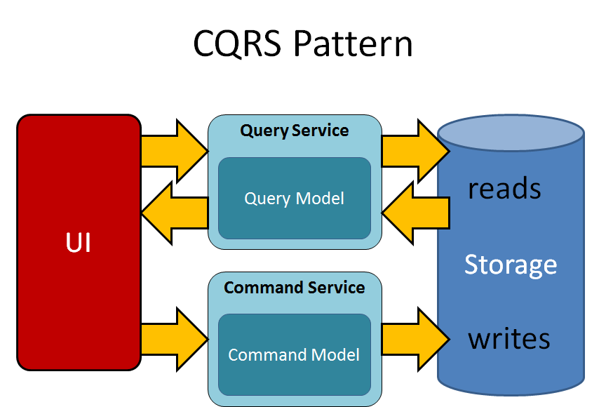
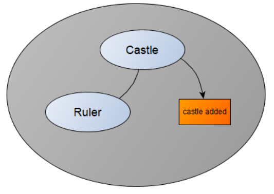
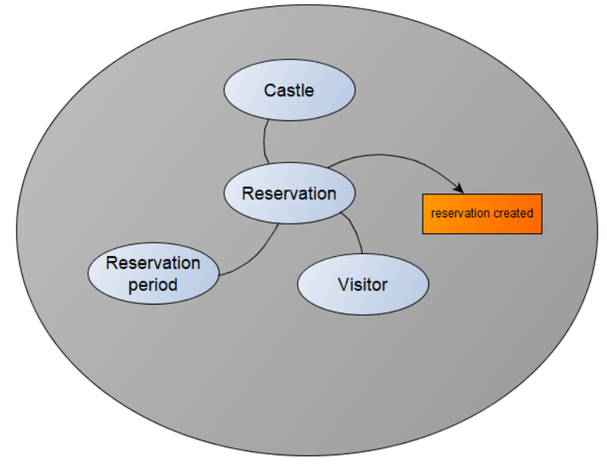
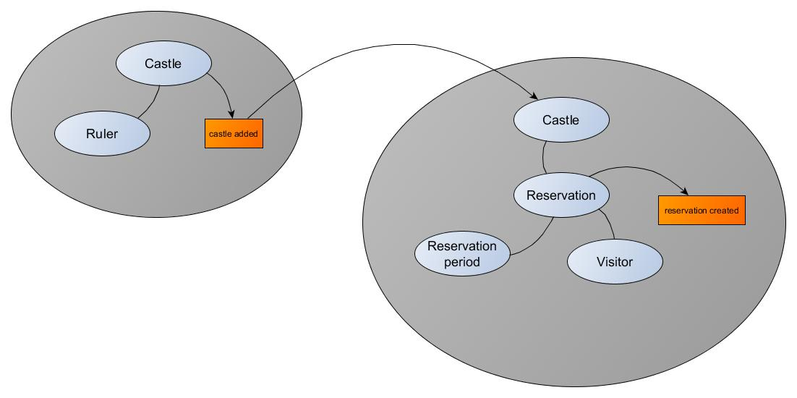

# Domain Driven Design
DDD concept is used for strategic design. It uses bounded context an ubiquitous language to model application.
It is also about transition of BC from problem space to Solution space.

## Concept
* Problem space - where you perform high-level strategic analysis and design steps within the constraints of a given project
* Solution space - where you actually implement the solution that your problem space discussions identify as your Core Domain
* Bounded context - semantic contextual boundary. This means that within the boundary each component of the software model
  has a specific meaning and does specific thingsThere should be one team assigned to work on one Bounded Context.
  There should also be a separate source code repository for each Bounded Context.
* Ubiquitous language - the software model inside the context boundary reflects a language that is developed by
  the team working in the Bounded Context and is spoken by every member of the team.
* Subdomain - is a sub-part of your overall business domain. It represents a single, logical domain model.
  There are three types of subdomains: Core Domain (your asset), Supporting Subdomain (can be outsourced), Generic Subdomain (can be purchased).
* Context mapping - identification of possible relations and integration between bounded contexts. Relation can be technical, organisational,
  related to business. (Shared Kernel, Customer-Supplier, Anticorruption Layer, Open host service, published language)    
* Entity - models an individual thing. Each Entity has a unique identity in that you can distinguish its individuality from among all other Entities
* Value object - models an immutable conceptual whole. Within the model the Value is just that, a value. Unlike an Entity, it does not have a unique identity.
* Aggregate - composed of one or more Entities or Value Objects. One of the entity is Aggregate Root. Aggregate forms a transactional consistency boundary.  
* Command - request which causes to create, update or delete Aggregate. A Command, when carried out, will cause a Domain Event.   
* Domain event - is a record of some business-significant occurrence in a Bounded Context. Proper ordering of domain events is important.
* Repository - technology agnostic storage of Aggregates
* Application Service - implements business logic that span multiple aggregates  
* Event storming - rapid design technique that is meant to engage both Domain Experts and developers in a fast-paced learning process.
  It is focused on the business and business process rather than on nouns and data. It can help you to quickly understand
  which scenarios you should be working on, and how they should be prioritized.
* Developers work with domain expert do define model. Focus should be given on business complexity but not the technical one.

## Related Architectural concepts
### Ports and adapters (Hexagonal architecture)

  

### Event sourcing
Event Sourcing can be described as persisting all Domain Events that have occurred for an Aggregate instance as a record
of what changed about that Aggregate instance. Rather than persisting the Aggregate state as a whole, you store all the
individual Domain Events that have happened to it.
The event store is just a sequential storage collection or table where all Domain Events are appended. Because the event
store is append-only, it makes the storage mechanism extremely fast, so you can plan on a Core Domain that uses Event Sourcing
to have very high throughput, low latency, and be capable of high scalability.  

### CQRS (Command Query Responsibility Segregation)
The CQRS pattern solve problem how to implement a query that retrieves data from multiple services. The dedicated query service
and database is implemented with required data model. The data model typically represents a client view on data, so there is
no need to call multiple services and then aggregate data for a client.

  

## Castle catalogue Bounded context
### Domain Dictionary
* Castle - Castle is a large building, typically of the medieval period, fortified against attack with thick walls,
  battlements, towers, and often a moat. Application maintains data about listed castles in order to provide useful
  data for castle visitors.
* Ruler - Owner of a castle and surrounding lands. Ruler usually build a castle to protect the people living inside.

### Bounded context

## Castle trip reservation Bounded context
### Domain Dictionary
* Castle - subject of reservation for visitors
* Reservation period - period of time when it is possible to reserve castle for visitors
* Castle opening hours - period of time when a castle is open
* Reservation - represents the plan for one visitor, or group of visitors to visit Castle during opening hours in the future
* Visitor - an individual who visiting or he/she likes to visit a castle

### Bounded context

The _Castle added_ event can carry complete castle data, castleID only, or custom data set required by other context.
In case only castleID is provided, the reservation context can retrieve required castle details via Open host service of
the Castle context. The integration implementation can vary according the application needs.

## Context map

## References
