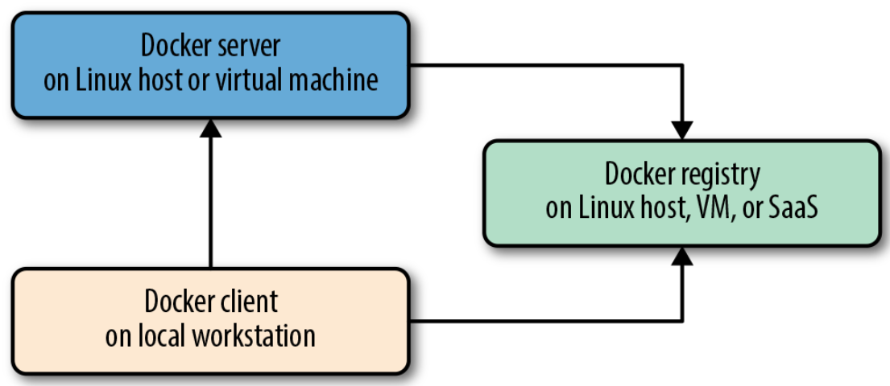
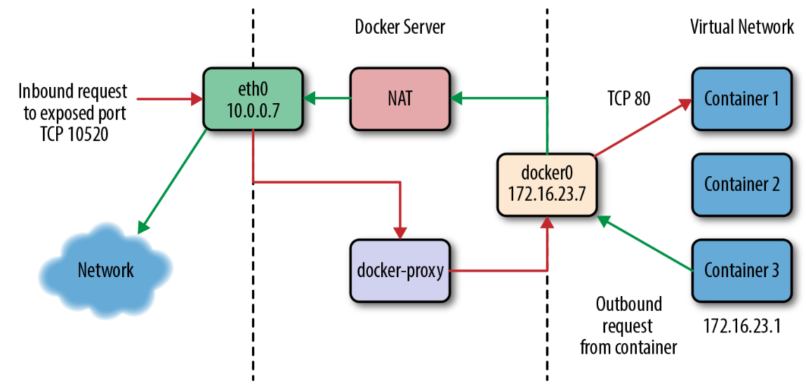

# Docker
Docker is a tool designed to make it easier to create, deploy, and run applications by using containers. Containers allow a developer to package up an application with all of the parts it needs, such as libraries and other dependencies, and ship it all out as one package.
In a way, Docker is a bit like a virtual machine. But unlike a virtual machine, rather than creating a whole virtual operating system, Docker allows applications to use the same Linux kernel as the system that they're running on and only requires applications be shipped with things not already running on the host computer. This gives a significant performance boost and reduces the size of the application.

* Docker client - the `docker` command used to control most of the Docker workflow and talk to remote Docker servers.
* Docker server - the `dockerd` command that is used to start the Docker server process that builds and launches containers via a client.
* Docker images - Docker images consist of one or more filesystem layers and some important metadata that represent all the files required to run a Dockerized application. A single Docker image can be copied to numerous hosts. An image typically has both a name and a tag. The tag is generally used to identify a particular release of an image.
* Docker container - A Docker container is a Linux container that has been instantiated from a Docker image. A specific container can exist only once; however, you can easily create multiple containers from the same image.
* Docker registry - Docker registry stores Docker images and their metadata (https://hub.docker.com/)
* Atomic host - An atomic host is a small, finely tuned OS image, like Fedora CoreOS, that supports container hosting and atomic OS upgrades.



## Docker and Network
Default configuration use bridge mode. To understand bridge mode, it’s easiest to think of each of your Docker containers as behaving like a host on a private network. The Docker server acts as a virtual bridge and the containers are clients behind it. A bridge is just a network device that repeats traffic from one side to another. So you can think of it like a mini–virtual network with each container acting like a host attached to that network.


* list docker networks `docker network ls`
* see details of docker network `docker network inspect <network_id>`

## Container filesystem layers
Docker containers are made up of stacked filesystem layers, each identified by a unique hash, where each new set of changes made during the build process is laid on top of the previous changes. That’s great, because it means that when you do a new build, you only have to rebuild the layers that follow the change you’re deploying.

### Create your own image and run container

1. Ssh to Vagrant box `vagrant ssh`
2. Pull small alpine linux image `docker pull alpine`. It has size around 3MB.
3. Run date command using new container from alpine image `docker run alpine /bin/date`. The container immediately exits after date is displayed.
4. You can run container in iterative attached mode `docker run -it alpine /bin/sh` Now you can type `date` command. Use `exit` to exit from container.
5. To build your own image, you need to create Dockerfile `vi Dockerfile`

```
FROM alpine

RUN apk add --update curl && rm -rf /var/cache/apk/*
```

6. Now, build the image `docker build --rm=true --tag=alpinewithcurl:1.0 .`. As you see, you should tag/version image.
7. List images `docker images`. You should see alpinewithcurl image in the list.
8. To run curl in container using your new image `docker run alpinewithcurl curl -s --head http://google.com | grep ^Date: | sed 's/Date: //g'`
It gets current time from goole site.
9. To list created containers `docker ps -a`. See there are also containers from aplpine and alpinewithcurl images.
10. To see container details ` docker container inspect <container_id>`
11. You can delete containers `docker container rm <container_id>`


## References
* https://www.docker.com/get-started
