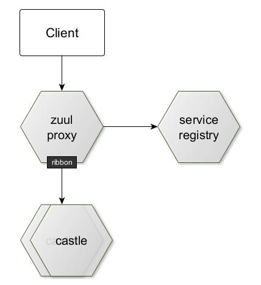

# Netflix Zuul gateway
[Zuul](https://github.com/Netflix/zuul/wiki) is an edge service that provides dynamic routing, monitoring, resiliency, security, and more.
Spring Boot starter automatically configures Zuul components. If there is service discovery enabled (@EnableDiscoveryClient),
the Zuul will use Ribbon client side load balancing with Eureka registry to discover service and balancing 
load to underlying service instances.



## Setup Zuul proxy
If the simple 
1. Include `org.springframework.cloud:spring-cloud-starter-netflix-zuul` Spring Boot starter into your application.
   Use the https://start.spring.io/ app and add dependency named as "Zuul" 
2. The SpringBoot application configuration class must be annotated with _@EnableZuulProxy_ annotation 
3. The Zuul servlet is by default mapped to /zuul context
4. The client then address service via API Gateway as _/zuul/service_name/service_context_.
   For castle service it is:  _/zuul/castle/castles_ 
5. You can also customize the path mappings of a service
```
zuul.routes.castle.path=/castleservice/**
zuul.routes.castle.serviceId=castle
```  
6. By default, all the services registered with Eureka Server will be exposed. You can use zuul.ignored-services 
property to disable this behavior and expose only the explicitly configured services. 
```
zuul.ignored-services=*
```

## References
* https://spring.io/projects/spring-cloud-netflix
    

