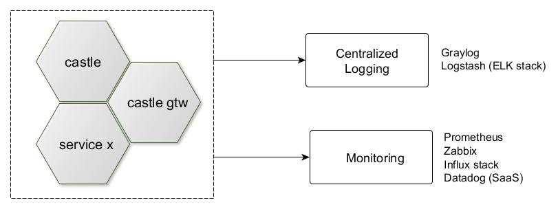

# Logging and Monitoring
Diagnostics and Monitoring as part of DevOps is important aspect of distributed application.
You should have always your system under control. This must be considered in initial 
project phase and implemented accordingly. 



## Logging
Spring Boot uses popular Logback framework to support logging. You should adopt the best 
practices and to have project level strategy how to implement logging. There are ready
to use centralized logging solutions as [Graylog](https://www.graylog.org/) and [ELK Stack](https://www.elastic.co/elk-stack).
From application module pov, you need to configure Logback appender which sends logs to Graylog, or Logstash. 
Logging solution also provide logs analytics.

### Graylog

1. Include Graylog appender on module classpath `compile("com.github.pukkaone:logback-gelf:1.1.9")`
2. Configure Logback (logback.xml) to send log messages to Graylog
```xml
<?xml version="1.0" encoding="UTF-8"?>
<configuration>
	<property resource="bootstrap.properties" />
	<include resource="org/springframework/boot/logging/logback/base.xml" />
    <appender name="GRAYLOG2" class="com.github.pukkaone.gelf.logback.GelfAppender">
		<graylogHost>${GRAYLOG_PROTOCOL:-udp}:${GRAYLOG_SERVER:-192.168.122.230}</graylogHost>
		<graylogPort>${GRAYLOG_PORT:-12201}</graylogPort>
		<originHost>${HOST_IP:-dev},${RANCHER_NET_IP:-dev}</originHost>
		<levelIncluded>true</levelIncluded>
		<locationIncluded>false</locationIncluded>
		<loggerIncluded>true</loggerIncluded>
		<markerIncluded>true</markerIncluded>
		<mdcIncluded>true</mdcIncluded>
		<threadIncluded>false</threadIncluded>
		<facility>gelf-java</facility>
		<additionalField>application=${spring.cloud.config.name:-undefined}</additionalField>
		<additionalField>environment=${CONFIG_LABEL:-dev}</additionalField>
		<marshaller	class="com.github.pukkaone.gelf.logback.DefaultGelfMessageFactory">
			<fullMessagePattern>%d{HH:mm:ss.SSS} [%thread] %-5level %logger{36} - %msg %n</fullMessagePattern>
		</marshaller>
	</appender>
	
    <root>
		<level value="INFO" />
		<appender-ref ref="GRAYLOG2" />
	</root>	
</configuration>	
```
3. You can introduce log markers to mark different log messages scopes, or groups.
   For example define LogMarkers.class as:
```java
import org.slf4j.Marker;
import org.slf4j.MarkerFactory;

public class LoggerMarkers {
    public static final Marker SECURITY = MarkerFactory.getMarker("SEC");
    public static final Marker OPERATIONS = MarkerFactory.getMarker("OPS");
    public static final Marker DIAGNOSTIC = MarkerFactory.getMarker("DIA");
}
``` 
4. And use it as:
```java
LOG.debug(LoggerMarkers.DIAGNOSTIC, "Imortant message");
```

## Monitoring
Monitoring requires metrics to be exposed by application module. The Spring Boot Actuator module implements
useful endpoints for module monitoring. One of the endpoint is /metrics endpoint. Including Prometheus extension,
you get alsi /prometheus endpoint, which is consumed by the Prometheus server.

1. Include Actuator's Prometheus extension on project classpath `compile ('io.micrometer:micrometer-registry-prometheus')`
2. Check if /actuator/prometheus is added
3. Now, Configure prometheus sources to include castle module. There is configuration file _/etc/prom-conf/prometheus.yml_ in prometheus    container, ehere the sources should be configured for every module:
```
- job_name: 'castle'
  metrics_path: /actuator/prometheus
  static_configs:
    - targets:
      - '10.0.2.2:9194'
```
  The 10.0.2.2 is the IP address of host machine where Vagrant was started.
  To connect to prometheus container use `docker exec -it <container-id> /bin/sh` 
  The prometheus configuration can be reloaded using API. Execute  `curl -X POST http://localhost:19090/-/reload` from Vagrant box
  machine. Then you check prometheus targets configuration here http://192.168.122.230:19090/targets
4. The Grafana can be used to visualise metrics


