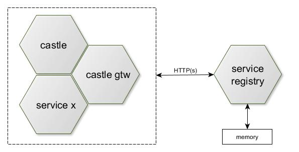

# Service Registry
The location of the distributed modules should be transparent for clients. The current module address should be
registered at central registration service on startup. A module should be then discoverable for other modules, which
need to communicate wit registered one. Spring Cloud wraps Netflix Eureka server and discovery client.

## Implement and start Eureka server      
1. Include `org.springframework.cloud:spring-cloud-starter-netflix-eureka-server` Spring Boot starter into your application.
   Use the https://start.spring.io/ app and add dependency named as "Eureka Server"     
2. The SpringBoot application configuration class must be annotated with _@EnableEurekaServer _ annotation 
3. The Eureka server does not have a back end store, but the service instances in the registry all have to 
   send heartbeats to keep their registrations up to date (so this can be done in memory). 

## Add Eureka discovery client
1. Include `org.springframework.cloud:spring-cloud-starter-netflix-eureka-client` Spring Boot starter into your application.
   Use the https://start.spring.io/ app and add dependency named as "Eureka Discovery"  
2. The SpringBoot application configuration class must be annotated with _@EnableEurekaClient _ annotation  
3. You can use Eureka API, Netflix modules as Ribbon, or Zuul, or Feign REST API client to discover services.   
4. Clients have an in-memory cache of Eureka registrations (so they do not have to go to the registry for every request to a service).
            

## References
* https://spring.io/projects/spring-cloud-netflix
  

