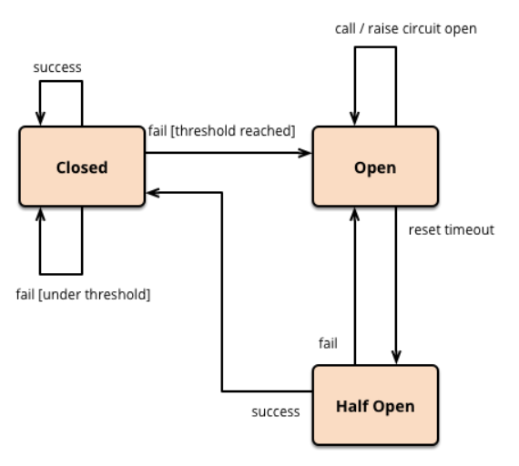

# Design for failure

## Netflix Hystrix
The [Hystrix](https://github.com/Netflix/Hystrix) is latency and fault tolerant library from Netflix.
Currently in maintenance mode.

## Circuit breaker pattern
You wrap a protected function call in a circuit breaker object, which monitors for failures. Once the failures reach 
a certain threshold, the circuit breaker trips, and all further calls to the [circuit breaker](https://martinfow  ler.com/bliki/CircuitBreaker.html)
return with an error, without the protected call being made at all.

## Bulkhead pattern
Smartly partition service instances into different groups, based on consumer load and availability requirements. 
This design helps to isolate failures, and allows sustaining service functionality for some consumers, even during a failure.
 

## References
* http://blog.christianposta.com/microservices/3-easy-things-to-do-to-make-your-microservices-more-resilient/ 
* [Resilience 4 J](https://github.com/resilience4j/resilience4j)

