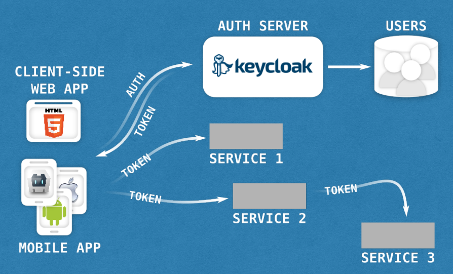

# Security
It is important to secure application REST API. You need to iclude IAM solution 
in application architecture. The modern REST APIs can be secured by OpenID Connect.
OpenID Connect is a simple identity layer on top of the OAuth 2.0 protocol. 
It allows Clients to verify the identity of the End-User based on the authentication 
performed by an Authorization Server, as well as to obtain basic profile information 
about the End-User in an interoperable and REST-like manner. 

## OpenID Connect flow

## Keycloak as Auth server

## Keycloak server
Keycloak IAM server is Wildfly AS based application and can be downloaded [here](https://www.keycloak.org/downloads.html).
It acts as Authentication server and maintains User accounts, security groups, roles, and more. 

1. Start Keycloak server `keycloak-4.5.0.Final\bin\standalone.bat`
2. Open Admin console and explore http://localhost:9080/auth/ (admin/password)
3. Get the [rsa public key](http://localhost:9080/auth/admin/master/console/#/realms/testrealm/keys) and
   use it in module configuration.
   
## Spring Boot application
There is Keycloak adapter for Spring Security framework available. You can utilize Spring Boot Keycloak starter to ease
bootstrap of Keycloak adapter components: `org.keycloak:keycloak-spring-boot-2-starter:4.0.0.Final`.

## Explore JWT Token
Use [jwt.io](https://jwt.io/) site to explore JWT tokens. Paste your token issued by Keycloak and
check the token attributes.

## References 
* The [OpenID Connect](https://openid.net/connect/)

