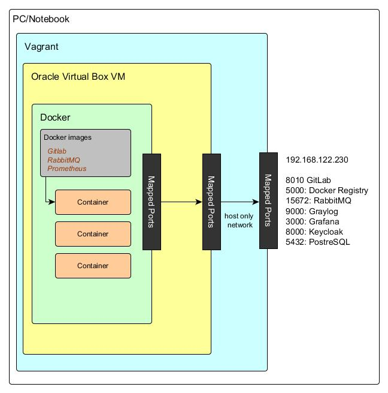

# Vagrant based DEV environment
  

# Vagrant based environment preparation
To run multiple services as Docker containers on single PC/Laptop, we need to
setup the Virtual Machine with Docker installed. The Vagrant tool is used to ease
setup of such environment. You need to have Oracle Virtual box and Vagrant tools
installed. There are two options, how to initialize Vagrant based environment.

## 1. Build Vagrant box from scratch
Use provided Vagrant file along with `vagrant up` command. The VM will be build
and initialized from scratch. This can take a while and you will need to start up
all required services as Docker containers. If you like to speed up
env setup, go for option 2.

## 2. Import prepared Vagrant box image
* Change directory to one where the Vagrant file is located
* Copy the microservices.box file to this directory
* Install the Vagrant vbguest plugin: `vagrant plugin install vagrant-vbguest`
* Run command `vagrant vbguest`
* Add Vagrant box: `vagrant box add microservices microservices.box`
* Start Vagrant microservice env: `vagrant up`

# Services provided by Vagrant environment

## GitLab
* url: http://192.168.122.230:8010/
* default admin account admin@example.com/Expert123*
* data are stored on VB machine in /srv/gitlab folder

## Docker registry
* 192.168.122.230:5000
* data are stored on VB machine in /srv/registry folder

## RabbitMQ
* url: http://192.168.122.230:15672/
* default account user/password

## Graylog
* url: http://192.168.122.230:9000/
* default account admin/admin

## Prometheus
* http://192.168.122.230:19090

## Grafana
* http://192.168.122.230:3000/
* default account admin/admin

## Keycloak IAM
* http://192.168.122.230:8000/
* default account admin/password

## PostreSQL
* JDBC: jdbc:postgresql://192.168.122.230:5432/microservices
* microservices/microservices123

## Usefull stuff
* Export Vagrant box `vagrant package --output microservices.box`
* Add Vagrant box `vagrant box add mynewbox mynew.box`
* Connects to machine via SSH `vagrant ssh`
